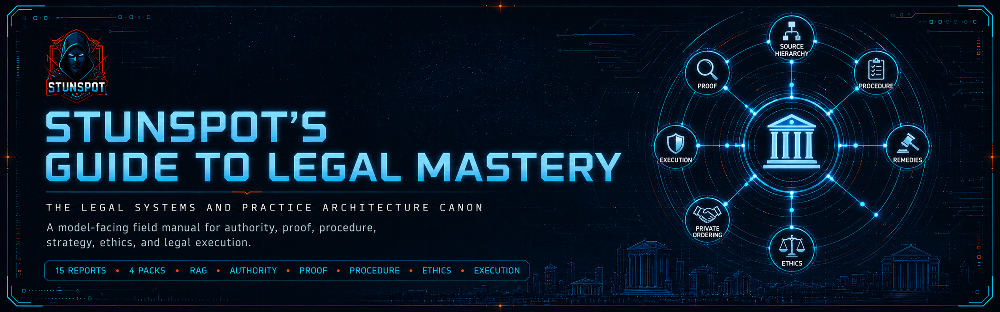

<p align="center">
  
</p>

# Stunspot's Guide to Legal Mastery

**The Legal Systems and Practice Architecture Canon**  
*A model-facing field manual for authority, interpretation, proof, procedure, strategy, private ordering, ethics, legal failure diagnosis, and legal execution.*


[](https://doi.org/10.5281/zenodo.21039250)

*Stunspot's Guide to Legal Mastery* is a Markdown-native knowledge canon built primarily for AI/RAG ingestion and legal-systems reasoning. It is readable by humans, but its first audience is the model: an assistant, retrieval pipeline, long-context workspace, or project knowledge base that needs stable legal vocabulary, source discipline, procedural awareness, proof logic, and diagnostic guardrails.

This is not a consumer legal self-help guide and it is not legal advice. Treat it as a structured reasoning substrate: a canon for helping AI systems and serious readers think more clearly about how law becomes authority, how facts become proof, how procedure gates remedies, how private ordering works, how legal work fails, and how reliable legal artifacts are produced.

When loaded into an AI workspace, RAG system, NotebookLM-style corpus, agent memory layer, or long-context session, the canon gives the model a dense operating grammar for:

- distinguishing validity, authority, legitimacy, and efficacy
- ranking legal sources by jurisdiction, forum, source type, chronology, and precedential status
- constructing institutionally adoptable interpretations rather than merely plausible readings
- separating raw reality, allegations, records, evidence, admissibility, found facts, and proof burdens
- preserving procedure, forum, remedy, review, enforcement, and finality constraints
- modeling litigation strategy, counseling, preventive law, transactional architecture, public law, private liability, ethics, access, pathology, and execution systems
- producing legal work product with stronger citation discipline, artifact fit, workflow control, and hallucination resistance

At its core is a practical systems premise:

> Legal reasoning is not semantic similarity with citations attached. It is the disciplined placement of claims, facts, authorities, procedures, remedies, roles, and risks inside an institutional power system that decides what can be adopted, enforced, challenged, repaired, or abandoned.

Use it as RAG substrate.  
Use it as legal-reasoning doctrine for AI systems.  
Use it as a map of legal power, proof, process, ethics, and execution.  
Verify live law before relying on it.

Part of the Stunspot’s Guide to… Advanced Knowledge Base Library
Browse the full library: 
[Gateway Repo](https://github.com/Stunspot/stunspots-guides) · [stunspot.com](stunspot.com/#guides)

---

## Start Here

- [Canon Map](./docs/canon-map.md) — the report sequence and conceptual dependency chain.
- [How to Use This Canon](./docs/how-to-use-this-canon.md) — practical guidance for humans, AI assistants, and RAG workflows.
- [Knowledge Packs](./docs/knowledge-packs.md) — which upload format to use for different systems.

The public `docs/` directory is the navigation and guidance layer. The source-report corpus does **not** live under `docs/`; it lives in [`knowledge-packs/by-report/`](./knowledge-packs/by-report/).

---

## Corpus Shape

| Layer | Count | Location | Purpose |
|---|---:|---|---|
| Source reports | 15 | [`knowledge-packs/by-report/`](./knowledge-packs/by-report/) | Canonical individual report units. Best for selective retrieval, citation, inspection, and editing. |
| Compiled packs | 4 | [`knowledge-packs/compiled-packs/`](./knowledge-packs/compiled-packs/) | Grouped upload packs by major volume. Recommended default for most AI/RAG systems. |
| Omnibus | 1 | [`knowledge-packs/omnibus/`](./knowledge-packs/omnibus/) | Whole-corpus bundle for long-context systems, local archive, and full-canon import. |
| Documentation | 3 public guide pages | [`docs/`](./docs/) | Site landing page, canon map, usage guide, and pack guide. |

Most users should start with the **compiled packs**. They preserve the canon's volume structure while avoiding both extremes: fifteen separate files or one very large omnibus file.

---

## Canon Architecture

The canon is organized across **15 reports** and **4 compiled volumes**.

### Volume 1 — A-D: Foundations of Law, Authority, and Judgment

This volume establishes the legal system as a layered architecture of power, authority, source hierarchy, interpretation, and proof.

- **A. Legal Reality, Sovereign Power, and Jurisprudential Foundations** — defines law as a self-referential system that converts political, moral, economic, and social demands into enforceable normative reality.
- **B. Sources of Law, Authority Hierarchies, and Doctrinal Architecture** — maps legal authority as a jurisdictional, hierarchical, temporal, and procedural lattice rather than a flat pile of relevant text.
- **C. Interpretation, Legal Reasoning, and Argument Architecture** — builds the interpretive stack for constructing meanings that courts, agencies, arbitrators, drafters, and other legal decision-makers can legitimately adopt.
- **D. Facts, Evidence, Proof, and Epistemic Burdens** — explains how law converts raw events into admissible, credible, burden-satisfying proof through formal epistemic gates.

### Volume 2 — E-K: Core Operating Domains of Legal Practice

This volume moves from foundations into the main operating fields of legal action: procedure, advocacy, counseling, transactions, public law, private law, and criminal law.

- **E. Procedure, Remedies, and Forum Control** — treats procedure as the action architecture that determines whether rights can become enforceable institutional outcomes.
- **F. Litigation Strategy, Advocacy, and Adversarial Control** — maps adversarial leverage, case theory, motion practice, narrative control, settlement pressure, and strategic sequencing.
- **G. Client Counseling, Risk Governance, and Preventive Law** — turns legal knowledge into decision support, risk governance, and preventive structures before disputes mature.
- **H. Transactional Architecture, Contract Design, and Private Ordering** — frames contracts, corporate instruments, and deal structures as designed private legal systems.
- **I. Public Law, Rights Enforcement, and Administrative Governance** — covers constitutional, statutory, regulatory, rights-enforcement, and administrative power.
- **J. Private Law, Civil Obligation, and Liability Systems** — organizes tort, contract, property, restitution, civil liability, and private enforcement logic.
- **K. Criminal Law, Punishment, and State Coercion** — maps offenses, culpability, prosecution, defense, punishment, sentencing, public coercion, and process safeguards.

### Volume 3 — L-M: Constraint, Specialization, and Legitimacy Layers

This volume constrains legal power with professional responsibility, fiduciary duty, access, legitimacy, and institutional trust.

- **L. Professional Responsibility, Fiduciary Duty, and Legal Ethics** — defines the internal restraint system that keeps legal expertise from becoming conflict, self-dealing, or procedural vandalism.
- **M. Power, Inequality, Access to Justice, and Institutional Legitimacy** — examines how resources, repeat-player advantages, procedural burdens, social inequality, and institutional legitimacy shape law in action.

### Volume 4 — N-O: Diagnosis, Failure Modes, and Execution Systems

This volume converts the canon into diagnostic and operational practice.

- **N. Legal Failure Modes, Case Pathology, and Diagnostic Repair** — provides the failure taxonomy for finding load-bearing defects before clever work product makes the matter worse.
- **O. Legal Research, Writing, Workflows, and Practice Artifacts** — formalizes legal execution: research protocols, drafting standards, cite checks, workflow controls, artifact design, and knowledge capture.

---

## Model-Use Doctrine

When using this canon inside an AI system, instruct the model to treat it as a reasoning framework, not as a live-law oracle.

Recommended operating rules:

1. **Verify current law externally.** Always check jurisdiction, date, amendment status, negative treatment, local rules, and governing forum before relying on a legal proposition.
2. **Preserve authority metadata.** Do not flatten constitutions, statutes, regulations, cases, dicta, dissents, treatises, agency guidance, contracts, and local rules into the same evidence type.
3. **Separate semantic relevance from legal control.** A text can sound relevant while carrying no binding authority in the forum.
4. **Track procedural posture.** Pleading, discovery, summary judgment, trial, appeal, enforcement, and collateral attack all change what matters.
5. **Connect facts to proof.** Distinguish allegation, admissible evidence, record fact, found fact, judicial notice, stipulation, presumption, and inference.
6. **State uncertainty cleanly.** When jurisdiction, source hierarchy, currentness, or procedural stage is unknown, say so and ask for or retrieve the missing control facts.
7. **Refuse fake certainty.** Do not invent citations, holdings, rule text, local deadlines, or jurisdiction-specific outcomes.

---

## Repository Structure

```text
.
├── README.md
├── LICENSE.md
├── CITATION.cff
├── CHANGELOG.md
├── COPY_CONTEXT.md
├── MANIFEST.md
├── STATUS.md
├── manifest.json
├── docs/
│   ├── _config.yml
│   ├── index.md
│   ├── canon-map.md
│   ├── how-to-use-this-canon.md
│   ├── knowledge-packs.md
│   ├── _layouts/
│   │   └── default.html
│   └── assets/
│       ├── css/
│       │   └── style.css
│       └── brand/
│           └── coldwire-bg.jpg
└── knowledge-packs/
    ├── by-report/
    ├── compiled-packs/
    └── omnibus/
```

The README and Pages layout intentionally retain references to future brand assets:

- `docs/assets/brand/readme-hero.png`
- `docs/assets/brand/pages-hero.png`
- `docs/assets/brand/social-preview.png`

Those placeholders are reserved for later hero/social imagery and are not corpus files.

---

## Metadata

- Version: **1.0**
- Released: **2026-06-28**
- License: **Creative Commons Attribution 4.0 International**
- Author: **Sam "stunspot" Walker / Collaborative Dynamics**
- Repository: `Stunspot/stunspots-guide-to-legal-mastery`
- Pages URL: `https://stunspot.github.io/stunspots-guide-to-legal-mastery/`

---

## License and Use

Unless otherwise stated, this repository is licensed under **Creative Commons Attribution 4.0 International** (**CC BY 4.0**). Commercial use is allowed with attribution; do not imply endorsement by Sam "stunspot" Walker / Collaborative Dynamics.

These materials are provided as-is for educational, research, design, AI/RAG, and reference use. Legal materials are high-impact: verify primary authority, currentness, local rules, and jurisdiction-specific requirements before relying on any conclusion.
