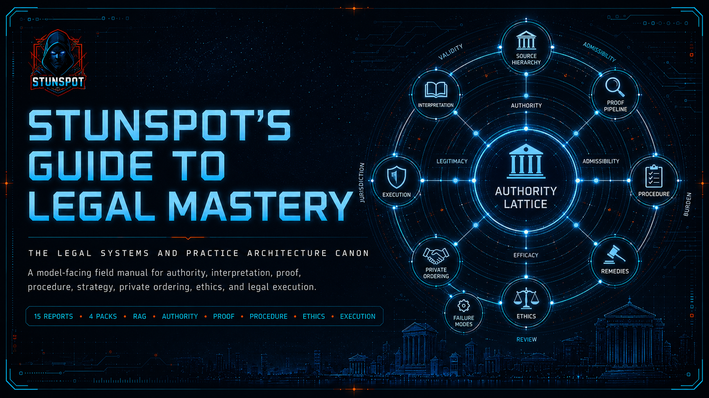

  

# Stunspot's Guide to Legal Mastery

**The Legal Systems and Practice Architecture Canon**  
*A model-facing field manual for authority, interpretation, proof, procedure, strategy, private ordering, ethics, legal failure diagnosis, and legal execution.*

This site is the navigation layer for the public release. The actual source-report corpus lives in the repository under `knowledge-packs/by-report/`; the compiled upload bundles live in `knowledge-packs/compiled-packs/`; the whole-corpus bundle lives in `knowledge-packs/omnibus/`.

The canon is built for AI/RAG use first. Human readers can browse it as a field manual, but its deeper purpose is to give a model a stable legal reasoning substrate: vocabulary, distinctions, authority discipline, proof logic, procedural guardrails, failure diagnostics, and legal work-product execution patterns.

## Start Here

- [Canon Map](./canon-map.md) — understand the 15-report sequence and how the volumes depend on one another.
- [How to Use This Canon](./how-to-use-this-canon.md) — load it into AI systems, use it with human workflows, and preserve legal verification discipline.
- [Knowledge Packs](./knowledge-packs.md) — choose source reports, compiled packs, or the omnibus by use case.

## What This Canon Is

*Stunspot's Guide to Legal Mastery* is not a collection of quick legal tips. It is a systems map of legal power and practice architecture: how law becomes valid, how authority ranks, how interpretation becomes institutionally adoptable, how facts become proof, how procedure shapes outcomes, how private parties build enforceable order, how professional ethics constrain legal power, and how legal matters fail or become operational artifacts.

## What This Canon Is Not

This canon is **not legal advice** and is not a substitute for jurisdiction-specific research. It should be used to improve reasoning, orientation, retrieval, and artifact design. Live legal conclusions still require current primary authority, citator checks, local-rule checks, procedural posture, and professional judgment.

## Corpus Snapshot

| Format | Count | Location | Best Use |
|---|---:|---|---|
| Source reports | 15 | `knowledge-packs/by-report/` | Precise retrieval, source inspection, selective upload, citation, editing. |
| Compiled packs | 4 | `knowledge-packs/compiled-packs/` | Recommended default for most AI/RAG project knowledge systems. |
| Omnibus | 1 | `knowledge-packs/omnibus/` | One-file import, full-corpus archive, long-context systems. |

## Recommended First Move

For most AI projects, upload the four compiled packs first. They preserve the canon's architecture while keeping file count manageable:

1. `knowledge-vol-1-a-d-foundations-of-law-authority-and-judgment.md`
2. `knowledge-vol-2-e-k-core-operating-domains-of-legal-practice.md`
3. `knowledge-vol-3-l-m-constraint-specialization-and-legitimacy-layers.md`
4. `knowledge-vol-4-n-o-diagnosis-failure-modes-and-execution-systems.md`

Then add selected source reports when you need narrower retrieval, more precise citation anchors, or report-level editing.
